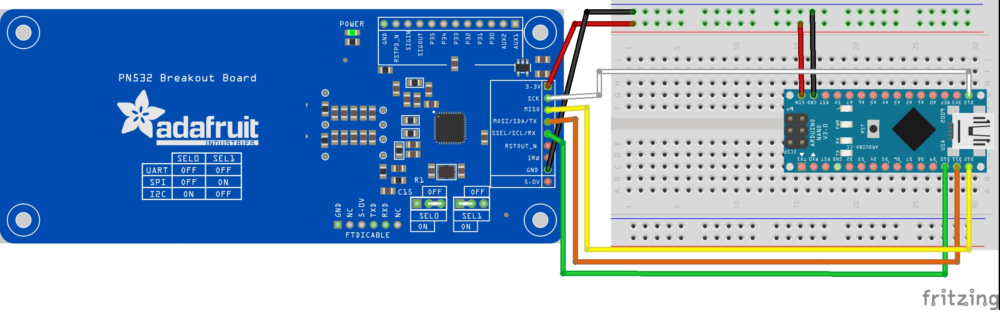

# Adafruit PN532

**Overview of the Adafruit PN532 RFID/NFC Breakout**

This document is meant to get you quickly setup. Check the [technical documents](https://learn.adafruit.com/adafruit-pn532-rfid-nfc/overview) for a full overview.

## Setup

- Add library the PN532 library via the Arduino IDE
- Follow wiring for SPI Interface

## SPI Wiring



### SPI Pin Matrix

| Nano | PN532               |
| ---- | ------------------- |
| VIN  | 3.3v                |
| 13   | **SCK**             |
| 12   | **MISO**            |
| 11   | **MOSI** / SDA / TX |
| 10   | **SSEL** / SCL / RX |
| GND  | GND                 |

## EEPROM Data Format

```
Sector  Block   Bytes                                                           Description
------  -----   -----                                                           -----------
                  0   1   2   3   4   5   6   7   8   9   10  11  12  13  14  15
          0       [                     Manufacturer Data                     ]   Manufacturer Block
          1       [                            Data                           ]   Data
          2       [                            Data                           ]   Data
  0       3       [-------KEY A-------]   [Access Bits]   [-------KEY B-------]   Sector Trailer
          0       [                            Data                           ]   Data
          1       [                            Data                           ]   Data
          2       [                            Data                           ]   Data
  1       3       [-------KEY A-------]   [Access Bits]   [-------KEY B-------]   Sector Trailer
```

### Data Example

```
------------------------Sector 1------------------------
Block 4  48 65 6C 6C 6F 20 4E 46 43 21 00 20 EA 5F 00 00  Hello NFC!. ⸮_..
Block 5  00 00 00 00 00 00 00 00 00 00 00 00 00 00 00 00  ................
Block 6  00 00 00 00 00 00 00 00 00 00 00 00 00 00 00 00  ................
Block 7  00 00 00 00 00 00 FF 07 80 69 FF FF FF FF FF FF  ......⸮.⸮i⸮⸮⸮⸮⸮⸮
```
